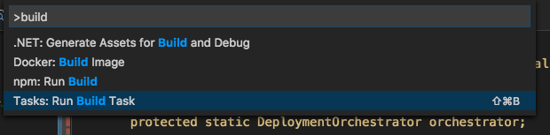
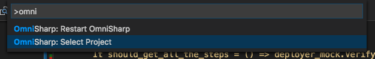
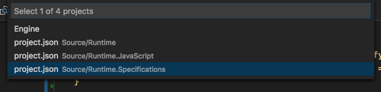
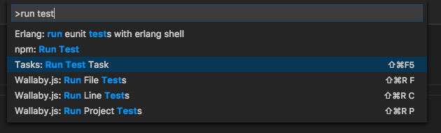

# Getting Started

Codebase is very oriented around automated tests, or rather specifications. This applies both to the C# code and the JavaScript code. 
When developing, it is assumed that one writes specifications for everything.

## Getting started

The codebase consists of both C# and JavaScript code. The specifics for the different languages are described in their own section.
There is a GIT submodule dependency that needs to be resolved. The submodules can either be pulled as part of the clone of this repository or 
one can do it as seperate actions.

### Part of clone

    git clone <url to repository> --recurse-submodules

### Seperate - after clone

    git submodule init

### Updating submodules 

    git submodule update

## Tests / specifications

Banantree has been written with specifications supporting and guaranteeing the quality of the code, this instead of using more traditional 
unit tests. 

As with all code in Banantree, you will find small specialized specifications. These are written in a specifying way using the Gherkin 
construct (given, when, then) found in [Behavior Driven Development](http://en.wikipedia.org/wiki/Behavior_Driven_Development).

## .NET / C#

Each of the .NET projects has dependencies that needs to be restored. If you are using the CLI, you can restore all dependencies for all projects
by running the following command at the root:

    dotnet restore

If you just want to build all the projects, you can also from the root of the project run:

    dotnet build **/project.json

There is also a [Visual Studio Code](http://code.visualstudio.com/) task set up for building. Meaning you can build directly from the editor.
Press F1 and type build, select the build command (Or use the shortcut directly)

The task is set to build the console project by default. The reason the specifications project is not set to be the default for build is that 
the task for running tests deals with building it as well.  

When working with the code, you need OmniSharp to point the project you're working out of - the project you're running. Typically this would be
the Specifications project or the Console project.

You need to select the correct C# Project for OmniSharp, press F1 and then:  

If you're using the Console project or any other as your main project, select that instead.

### Specifications

All the C# code has been specified by using  [MSpec](https://github.com/machine/machine.specifications) with an adapted style. 

Since we're using this for specifying units as well, we have a certain structure to reflect this. The structure is reflected in the folder structure and naming of files. 

The basic folder structure we have is :  

	(project to specify).Specifications  
		(namespace)  
			for_(unit to specify)  
				given  
					a_(context).cs  
				when_(behavior to specify).cs  

A concrete sample of this would be : 

	Runtime.Specifications  
		Deployments  
			for_DeploymentOrchestrator  
				given  
					orchestrator_and_one_deployer_and_no_steps.cs  
				when_orchestrating_with_one_deployer.cs  

The implementation can then look like this :

    public class when_orchestrating_with_one_deployer : given.orchestrator_and_one_deployer_and_no_steps
    {
        Because of = () => orchestrator.Orchestrate();

        It should_get_all_the_steps = () => deployer_mock.VerifyGet(d=>d.Steps, Times.Once);
        It should_forward_the_steps_to_steps_orchestrator = () => deployment_step_orchestrator_mock.Verify(d => d.Orchestrate(deployment_steps), Times.Once);
    }

The given context:

    public class orchestrator_and_one_deployer_and_no_steps : all_dependencies
    {
        protected static Mock<IDeployer>  deployer_mock; 
        protected static DeploymentOrchestrator orchestrator;

        protected static IEnumerable<IDeploymentStep> deployment_steps;

        Establish context = () => 
        {
            deployment_steps = new IDeploymentStep[0];
            deployer_mock = new Mock<IDeployer>();
            deployer_mock.SetupGet(d => d.Steps).Returns(deployment_steps);
            deployers_mock.SetupGet(d=>d.All).Returns(new[] { deployer_mock.Object });
            orchestrator = new DeploymentOrchestrator(deployers_mock.Object, deployment_step_orchestrator_mock.Object); 
        };
    }

Notice the `all_dependencies` inheritance. This is for gathering the actual dependencies in one place. These dependencies can then be manipulated,
since they are for the most part mocks and can then be configured for the specific context. One thing to notice is that the system itself
belongs to the specific context, not in `all_dependencies`.  

For mocking, or creating runtime fakes, we've used [Moq](http://code.google.com/p/moq/) for handling mocking of objects.

You can run the specifications from the CLI by navigating to the project you want to run the specifications for and typing:

    dotnet run

If you're using [Visual Studio Code](http://code.visualstudio.com/) you can run everything from the editor.

Once the project is set you can then press F1 and type "run test" and select the "Tasks: Run Test Task"

## JavaScript

### Specifications

All JavaScript code has been specified using [Jasmine](http://pivotal.github.com/jasmine/) with a similar style and structure as with the C# code. The folder structure is exactly the same. 

    import * as Context from "./given/nothing";
    import {Deployer} from "../../../Runtime.JavaScript/Deployments/Deployer";

    describe("when doing nothing", () => {
        let context = null;
        let deployer = null;

        beforeEach(() => {
            context = new Context.default();
            deployer = new Deployer();

            (becauseOf => {

            })();
        });

        it("should do absolutely nothing", () => true.should.be.true);
    });

The given context:

    export default class {
        constructor() {

        }
    }

### Wallaby

